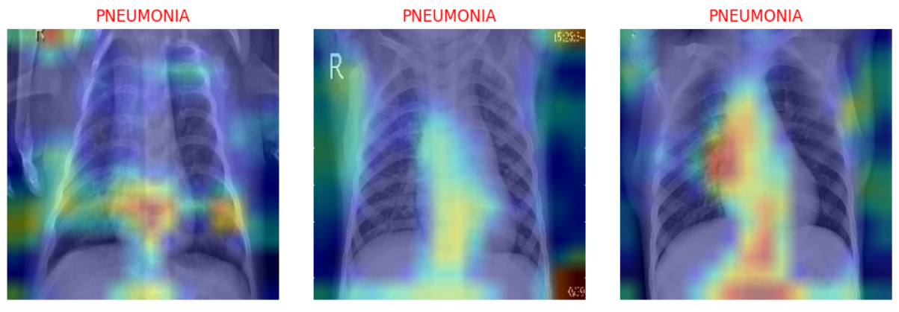

[](https://www.python.org/downloads/)
[](https://www.tensorflow.org/)
[](https://github.com/shap/shap)
[](https://arxiv.org/abs/1610.02391)
[](https://www.kaggle.com/paultimothymooney/chest-xray-pneumonia)
[](LICENSE)


# XAIPneumonia 

**XAIPneumonia** is a deep learning and explainable AI (XAI) project designed to classify pneumonia from chest X-ray images while providing interpretable visual explanations. It integrates cutting-edge techniques like SHAP, Grad-CAM, and Lime to improve clinical trust in automated diagnoses.



---

## 📌 Table of Contents

* [Overview](#-overview)
* [Features](#-features)
* [Project Structure](#-project-structure)
* [Installation](#-installation-with-poetry)
* [Download Required Assets](#-download-required-assets)
* [Usage](#-usage)
* [Explainability Methods](#-explainability-methods)
* [License](#-license)

---

## Overview

Medical AI models should be accurate **and** interpretable. **XPneumonia** meets this demand by:

* Detecting pneumonia from chest X-rays using deep learning (VGG16).
* Offering local and global model explanations using XAI methods.
* Supporting transparency in healthcare-related AI decisions.

The dataset used is from [kaggle](https://www.kaggle.com/datasets/paultimothymooney/chest-xray-pneumonia), containing labeled chest X-ray images.

---

## ✨ Features

* ✅ Binary classification: **Pneumonia** vs **Normal**
* 🧠 CNN model (VGG-like)
* 📊 Evaluation: accuracy, confusion matrix, F1-score
* 💡 XAI methods: **SHAP**, **Grad-CAM**, **Lime**
* 🧪 Modular code and reproducible pipeline

---

## 📁 Project Structure

```
xaipneumonia/
├───config/             # Configuration files 
├───data/               # Chest X-ray images
├───docs/               # Project documentation
├───experiments/        # Exploratory and test notebooks
├───frontend/           # UI components (dash)
├───models/             # Trained models
├───logs/               # Logging outputs
├───pipelines/          # ML pipelines (data ingestion, training, etc.)
├───src/
│   ├───base            # Base classes and model abstractions
│   ├───constants       # Global constants and enums
│   └───utils           # Utility functions and preprocessing
├───steps/              # Modular steps for pipeline orchestration
└───tools/              # Helper scripts 
```

---

## Installation with Poetry

1. **Clone the repository**:

```bash
git clone https://github.com/desire-del/xaipneumonia.git
cd xaipneumonia
```

2. **Install Poetry** (if not already):

3. **Install dependencies**:

```bash
poetry install
```

4. **Activate the virtual environment**:

```bash
poetry shell
```

---

## 📥 Download Required Assets

### 📦 Model Weights

To use the pretrained model without retraining:

1. Download the model my_model_2.keras file from this [link](https://drive.google.com/file/d/1hhm4HYeFsZ9K7HmwgjJnJvz9XL_fySe7/view?usp=sharing).
2. Create a folder called `models` at the root of the project if it doesn't exist.
3. Place the downloaded model file inside the `models/` folder.

### 🧾 Dataset

If you want to retrain the model from scratch:

1. Download the Chest X-ray dataset from [Kaggle - Chest X-Ray Images (Pneumonia)](https://www.kaggle.com/paultimothymooney/chest-xray-pneumonia)
2. Unzip the downloaded file.
3. Place the unzipped folders inside the `data/` directory, maintaining the structure:

```
data/
└──chestxray/
   ├── train/
   ├── val/
   └── test/
```


## 🚀 Usage

### Run dash app

```bash
cd frontend
poetry run python app.py
```
    

---

## 📜 License

This project is licensed under the MIT License. See the [LICENSE](LICENSE) file for details.

---

